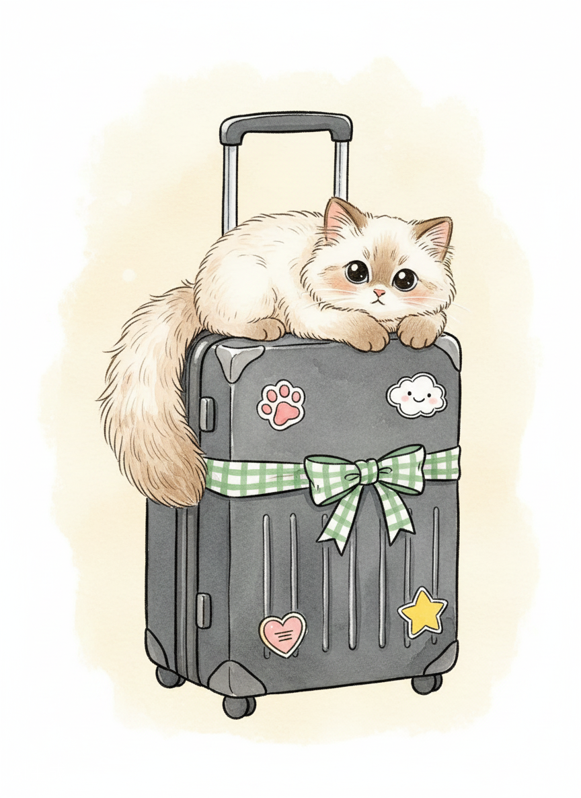

# 🐱 拾箱小猫 PackyCat（PurrPack）

> 一只会帮你收拾行李的小猫管家

**拾箱小猫 PackyCat** 是一款纯前端的可视化行李收纳清单应用。输入目的地、行程天数和旅行目的，小猫管家就会为你生成一份完整的行李清单；勾选物品时，对应的物品图标会实时飞入行李箱中，伴随可爱的猫咪动画，让收拾行李也变得有趣起来。



---

## ✨ 功能特性

- 🗺️ **智能清单生成** — 根据目的地（自动判断国内/港澳/台湾/国际）、行程天数和旅行目的生成个性化清单
- 🐱 **可视化收纳动画** — 勾选物品时图标飞入行李箱，猫咪会做出各种可爱动作
- 📱 **响应式布局** — 桌面端左右分栏，移动端场景图固定 + 清单滚动
- 💾 **本地持久化** — 数据保存在浏览器 localStorage，刷新不丢失
- 📸 **旅行纪念卡片** — 收拾完毕后一键生成精美海报图片
- 📜 **历史记录** — 自动保存最近 20 条行程记录

---

## 🚀 快速开始

### 环境要求
- **Node.js 20+**

### 安装与运行

```bash
cd app
npm install
npm run dev
```

浏览器打开 `http://localhost:3000` 即可使用。

### 构建部署

```bash
npm run build
```

构建产物输出到 `app/dist/` 目录，可直接部署到 GitHub Pages / Vercel / Netlify 等静态托管服务。

---

## 🛠 技术栈

| 技术 | 版本 |
|------|------|
| React | 19.2 |
| TypeScript | 5.9 |
| Vite | 7.2.4 |
| Tailwind CSS | 3.4.19 |
| shadcn/ui | New York 风格 |
| html2canvas | 1.4.1 |

---

## 📁 项目结构

```
app/
├── index.html          # HTML 入口
├── src/
│   ├── App.tsx         # 核心业务逻辑 + UI（~1300 行）
│   ├── index.css       # 全局样式 + 自定义动画
│   ├── main.tsx        # React 挂载入口
│   └── components/ui/  # shadcn/ui 组件（40+）
├── public/             # 静态素材（行李箱、物品、猫咪、背景）
└── dist/               # 构建产物

deploy/                 # 预构建的静态部署包
```

---

## 🎨 素材说明

本项目使用原创/授权的水彩风格插画素材，包括：
- 行李箱（黑色双尺寸版本）
- 18+ 件旅行物品图标
- 蜷缩睡觉的小猫管家
- 地板背景与粒子特效

---

## 📄 开源协议

MIT License

---

> 🧳 *麻麻要不要偷偷把我一起打包带走呀~*
